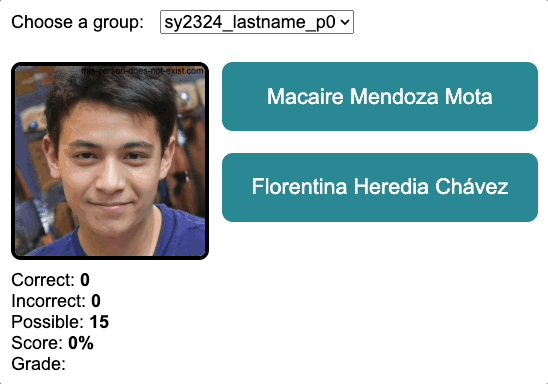

# Learn Student Names (Game)
This game shows you a person's photo and gives you two name options: one correct, one incorrect. Can you click the correct name?

You can download this game and add your own data (photos and names) to use it as a personal learning tool. Follow the instructions below!

## Download (and run) the app

Before you begin customizing this game with your own data, download and play the game (using the sample data) to see how it works.

The sample data includes AI-generated photo-realistic human faces from [This Person Does Not Exist - Random Face Generator](https://this-person-does-not-exist.com/en) and fake names from [Fake Name Generator](https://www.fakenamegenerator.com/).

This is what the game looks like:



*Note: The feature which offers spoken audio for student name (shown in the demo.gif) is not built into the game – it is available when you install the [Google Translate extension for Chrome](https://chrome.google.com/webstore/detail/google-translate/aapbdbdomjkkjkaonfhkkikfgjllcleb/RK%3D2/RS%3DBBFW_pnWkPY0xPMYsAZI5xOgQEE-).*

### Get started

1. Download this repository as a `.zip` file.
2. Unzip the .zip file and save the resulting folder on your computer.

### Play the game

1. Open the entire unzipped folder in a code editor app (like Notepad) on your computer. I recommend downloading and using the free [Visual Studio Code](https://code.visualstudio.com/download) editor because the [Live Server](https://marketplace.visualstudio.com/items?itemName=ritwickdey.LiveServer) extension makes it easy to start a local server.
2. Start a local server using a tool like Ritwick Dey's [Live Server](https://marketplace.visualstudio.com/items?itemName=ritwickdey.LiveServer) extension for VS Code. The server should launch a new window in your web browser where you can see (and play) the game.
2. If the text looks too small or too large, use keyboard shortcuts like CTRL+ and CTRL- (or ⌘+ and ⌘-) to [change the text size](https://www.lifewire.com/change-screen-or-device-font-size-31357) in your web browser window.

## How to customize your game

If you like how this game works and you want to use it with your own data (such as student photos and names) you'll need a collection of photos and a list of corresponding names.

When you have those ready, follow these steps:

### Add your own data: Photos

3. Open your unzipped folder and see the sample folder inside it (with the fake data) called `sy2223_lastname_p0`.
4. Create your own folder in the same directory as that one. I recommend using similar nomenclature as the sample folder, which uses underscores (`_`) to concatenate a school year (`sy2223`) with an instructor name (`lastname`) and a period number (`p0`) representing a specific class period during the school day.
4. Copy your own student photos (saved as JPEG images and using the lowercase `.jpg` file extension) into the folder you created. The first file should be named `0.jpg` and then numbers should increment by one without skipping:

	```
	0.jpg
	1.jpg
	2.jpg
	3.jpg
	```

	*Note: You may want to number these photos alphabetically by student first or last name.*

### Add your own data: Names

5. Then, in the `index.html` file, find the JSON object named `sy2324_lastname_p0` (the sample data). On a new line, create a new JSON object following the same nomenclature and format, but using your own student names. Here is an example of a JSON object for a group with four students:

	```
	window.sy2324_lastname_p0 = {
		"0": "Gladys R. Wilkerson",
		"1": "Joseph C. Herd",
		"2": "Deborah A. Knight",
		"3": "Mildreda Zambrano Ceballos"
	}
	```
	*Note: Make sure the JSON key for each student (like `"0"`) correctly matches the corresponding student photo (`0.jpg`).*

### Configure the game to use your data

1. Open the `index.html` file in your text editor and find the `        <option>` element that references the sample data:

	```
	<option value="sy2324_lastname_p0">sy2324_lastname_p0</option>
	```

2. Change instances of the string `sy2324_lastname_p0` to the name of the folder you created to contain your student photos.
3. If you are adding multiple groups of students, add an additional line for each group. (This enables the drop-down menu.) Here's example code for a game with three different groups:

	```
	<option value="sy2324_lastname_p0">sy2324_lastname_p0</option>
	<option value="sy2324_lastname_p4">sy2324_lastname_p4</option>
	<option value="sy2324_lastname_p5">sy2324_lastname_p5</option>
	```

## Reminders
* Never publish internal student data (like photos or names) to the Internet. This data should be protected and kept private. Do not upload your app to GitHub with student data included. If you are using GitHub to back up your files, use a .gitignore file to exclude local files from your remote repository.
* Ask students for their preferred names (and pronouns) before using name data from your school. Learning and using your students' preferred names is a practice of identity affirmation.

## Tech stack
This is a single-page app (a browser-based interactive game) written in JavaScript, HTML, and CSS.

## Issues and pull requests
* PRs are welcome – but please keep the architecture simple. The target audience for this tool is school teachers (who are not programming experts).
* If you have questions, [create a new issue](https://github.com/domlet/name-game-photo-matching/issues).

## Creator
Dom Brassey (she/they) ("Mx. Brassey") teaches computer science at [Coliseum College Prep Academy](https://www.ousd.org/ccpa). CCPA is a public school serving students (grades 6-12) in the eastern region of the Oakland Unified School District in Oakland, California, USA. 

* You can send a tip with [Venmo](https://venmo.com/u/Dom-Brassey)
* You can send a tip with [Cash App](https://cash.app/$domlet)